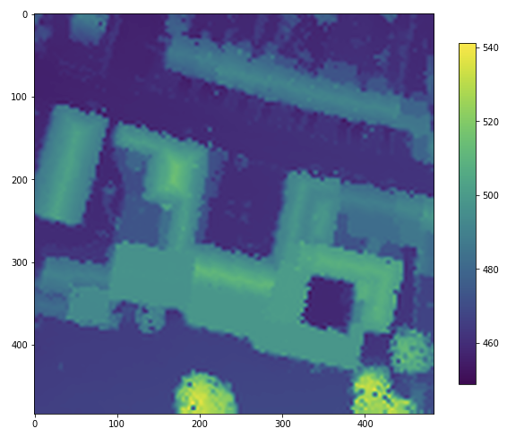

# 3D_houses
Type of Challenge: Learning &amp; Consolidation

[Link](https://github.com/leersmathieu/CRL-Turing-4.22/tree/master/Projects/3.3D_houses_numpy) to the descriptive challenge 

## The Mission

> We are LIDAR PLANES , active in the Geospatial industy. We would like to use our data to launch a new branch in the insurrance business.  So, we need you to build a solution with our data to model a house in 3D with only a home address.

## Steps to realise

### 1. Data
Comprendre les données pour pouvoir les utiliser

- Appréhender les dossiers DSM & DTM
- Appréhender LIDAR
- Apprendre à utiliser les fichier geoTIFF

Nettoyer les données


**Piste :**

- Fichier de formes ([shapefiles](https://desktop.arcgis.com/fr/arcmap/10.3/manage-data/shapefiles/what-is-a-shapefile.htm))
- Lidar

```
What is LIDAR ?

LIDAR is a method to measure distance using light. The device will illuminate a target with a laser light and a sensor will measure the reflection. Differences in wavelength and return times will be used to get 3D representations of an area.
Here is a LIDAR segmentation :
```


- Format de fichier  [geoTIFF](https://www.commentcamarche.net/contents/1205-tiff-format-tif)

### 2. Manipulation

Manipuler les données ainsi que les outils nécessaires à la réalisation de la mission

- Pandas
- NumPy
- Matplotlib
- 3D-Plot
- Rasterio

### 3. Interpretation & visualisation

En utilisant les outils précédement cités ainsi que les données (lidar) traitées, construire une représentation 3D d'une adresse entrée par un utilisateur.

## Realisation

Comme à mon habitude je vais tenter de résoudre le problème de manière simple mais efficace.

Je ne vais pas perdre de temps à la mise en place d'un service web ou d'une API, j'ai déjà pas mal de chose à comprendre afin de pouvoir réaliser l'objectif.

Mon but sera donc d'avoir un notebook executable qui remplira l'objectif de la mission en demandant à l'utilisateur un code postal, une rue et un numéro uniquement.
Celui-ci renverra plusieurs représentation en 3d de la zone indiquée.

### 1. Data

Après avoir récupéré les données nécessaires (+200 GB of tiff file from DSM & DTM) je décide de toutes les ajouter à un dictionnaire, ici je le nomme "RASTERS"
```py
# les DTM représentes les données au sol en wallonie
# les DSM représentes les données au dessus du sol en wallonie

dtm_hainaut = rasterio.open('/home/leers/Project/turing4/DATASET/Wallonia/DTM 2013-2014/DTM_HAINAUT/RELIEF_HAINAUT_MNT_2013_2014.tif')
dsm_hainaut = rasterio.open('/home/leers/Project/turing4/DATASET/Wallonia/DSM 2013-2014/DSM_HAINAUT/RELIEF_HAINAUT_MNS_2013_2014.tif')

dtm_liege = rasterio.open('/home/leers/Project/turing4/DATASET/Wallonia/DTM 2013-2014/DTM_LIEGE/RELIEF_LIEGE_MNT_2013_2014.tif')
dsm_liege = rasterio.open('/home/leers/Project/turing4/DATASET/Wallonia/DSM 2013-2014/DSM_LIEGE/RELIEF_LIEGE_MNS_2013_2014.tif')

dtm_namur = rasterio.open('/home/leers/Project/turing4/DATASET/Wallonia/DTM 2013-2014/DTM_NAMUR/RELIEF_NAMUR_MNT_2013_2014.tif')
dsm_namur = rasterio.open('/home/leers/Project/turing4/DATASET/Wallonia/DSM 2013-2014/DSM_NAMUR/RELIEF_NAMUR_MNS_2013_2014.tif')

dtm_luxembourg = rasterio.open('/home/leers/Project/turing4/DATASET/Wallonia/DTM 2013-2014/DTM_LUXEMBOURG/RELIEF_LUXEMBOURG_MNT_2013_2014.tif')
dsm_luxembourg = rasterio.open('/home/leers/Project/turing4/DATASET/Wallonia/DSM 2013-2014/DSM_LUXEMBOURG/RELIEF_LUXEMBOURG_MNS_2013_2014.tif')

dtm_brabant = rasterio.open('/home/leers/Project/turing4/DATASET/Wallonia/DTM 2013-2014/DTM_BRABANT_WALLON/RELIEF_BRABANT_WALLON_MNT_2013_2014.tif')
dsm_brabant = rasterio.open('/home/leers/Project/turing4/DATASET/Wallonia/DSM 2013-2014/DSM_BRABANT_WALLON/RELIEF_BRABANT_WALLON_MNS_2013_2014.tif')

RASTERS = {
    'Hainaut':[dtm_hainaut, dsm_hainaut],
    'Liège':[dtm_liege, dsm_liege],
    'Namur':[dtm_namur, dsm_namur],
    'Luxembourg':[dtm_luxembourg, dsm_luxembourg],
    'Brabant-wallon':[dtm_brabant, dsm_brabant]
}
```

### 2. Manipulation

**Ouvrir** un fichier **tiff** n'est pas une chose aisée et je l'ai appris à mes dépends.
En effet c'est une très grande "map" détaillée qui ne doit être ouverte de manière brut.

La première chose à faire pour travailler avec est donc de **créer une fonction** de "découpage" pour n'afficher qu'une partie du gros fichier

```py
def crop_raster(tiff, geojson):
```

Cette fonction va en plus, augmenter la résolution du fichier de sortie par 4 pour permettre de meilleurs rendu en 3D par la suite.  
Voir le [NoteBook](/main.ipynb) pour des informations plus détaillées sur les fonctions.

**En entrée la fonction prend le fichier tiff, apellé "raster", couplé à un geojson pour délimiter la zone à découper.**

La prochaine étape consiste donc à créer ce geojson en fonction d'une adresse entrée.

```py
post_code = input('Enter your postal code -> ')

# Geocoding d'une adresse via geocoder
g = geocoder.osm(f'belgium, {post_code}')
county = g.json['county']

# Chargement des données correspondante à la région choisies
dtm, dsm = RASTERS[county]   

try:
    city = g.json['city']
except:
    city = g.json['town']
    
adress = input('Enter your adress (street + number) -> ')
g = geocoder.osm(f'{adress}, {post_code} {city}')
coord = g.osm['x'],g.osm['y']
```

une fois le geojson récupéré dans une variable, je convertis les coordonées en lambert72 pour qu'elle puisse être comprise par ma fonction.

```py
inProj = Proj(init='epsg:4326')
outProj = Proj(init='epsg:31370')

x1,y1 = coord
x2,y2 = transform(inProj,outProj,x1,y1)
```

Enfin je crée une fonction "square" permettant de découper un carré autour des coordonées indiquées.
Le rayon est choisis par l'utilisateur.

```py
rayon = input("Rayon autour de l'adresse (ex: 20) -> ")
rayon = int(rayon)

def square(x,y,r):
  geojson = [{'type': 'Polygon', 'coordinates': [[(x - r, y - r), (x + r, y - r), (x + r, y + r), (x - r, y + r)]]}]
  return geojson

geojson = square(x2,y2,rayon)
```

### 3. Visualisation

Mon raster et mon geojson étant prêt, je peux maintenant les passer dans la fonction "crop_raster" et afficher le résultat de la découpe.
```py
crop_result = crop_raster(dsm,geojson)
```
  

Avant et après le UP de la résolution.




Il ne reste plus qu'a transformer cette image en représentation 3D.
Pour ce faire 2 outils ce sont démarqué selon moi.

#### Matplotlib

  


#### Open3D


